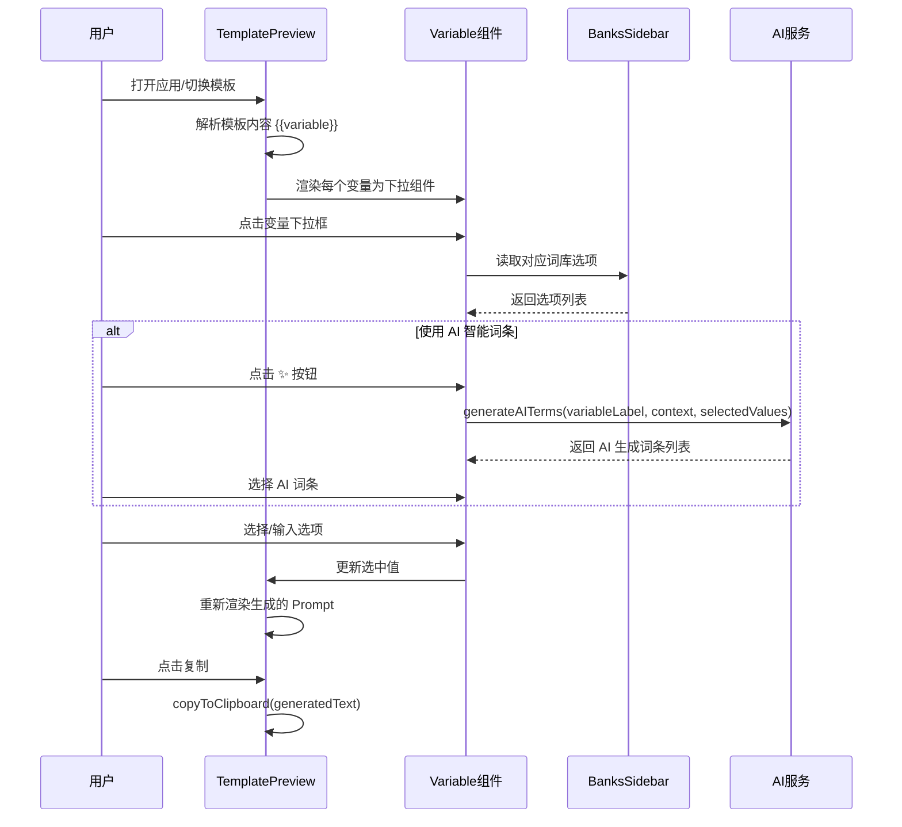
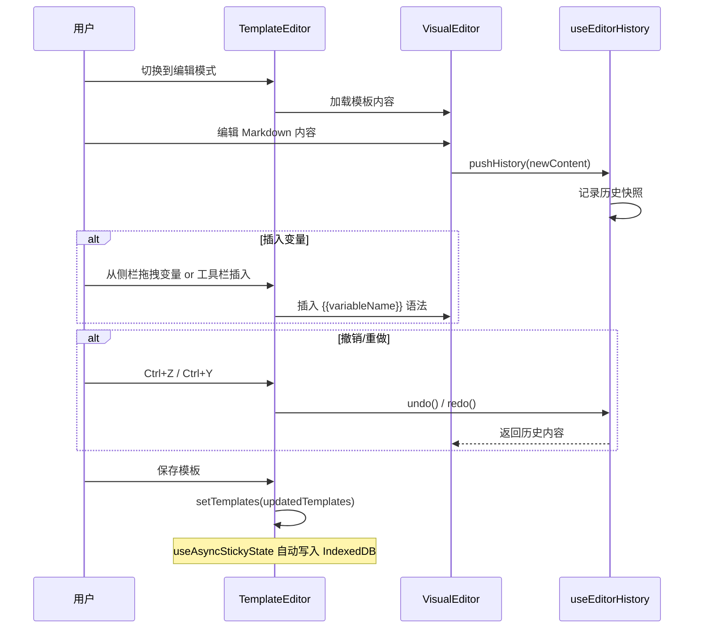
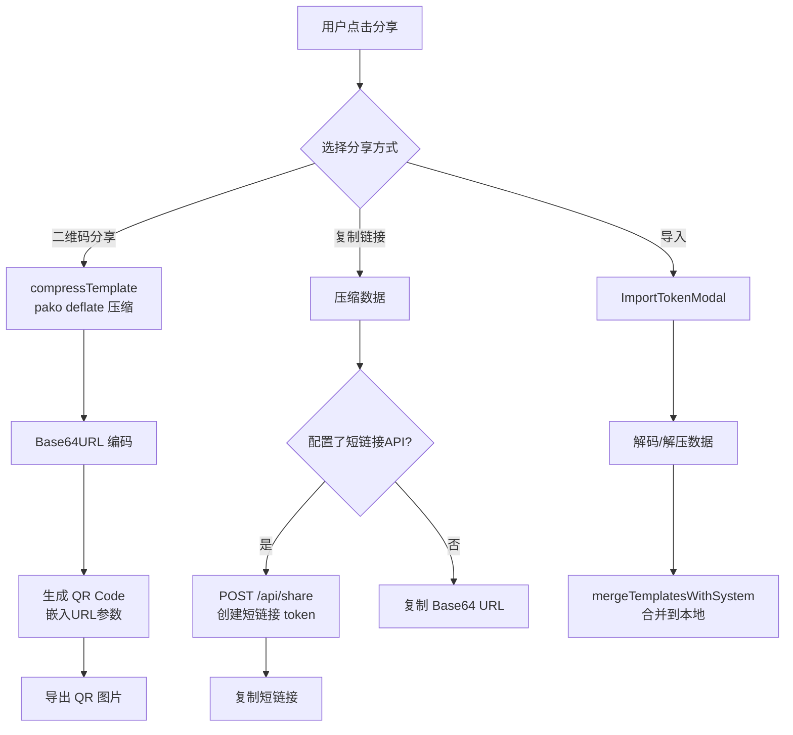
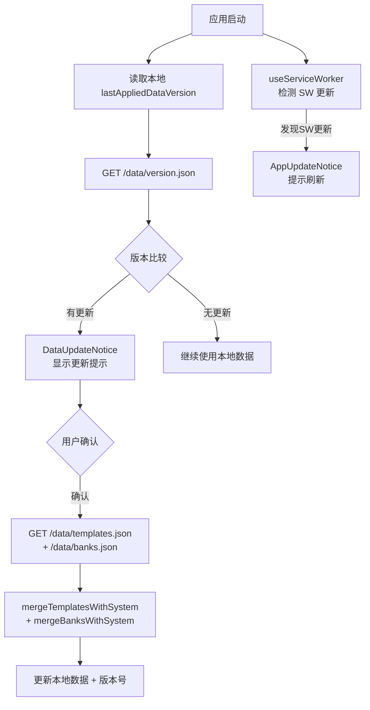
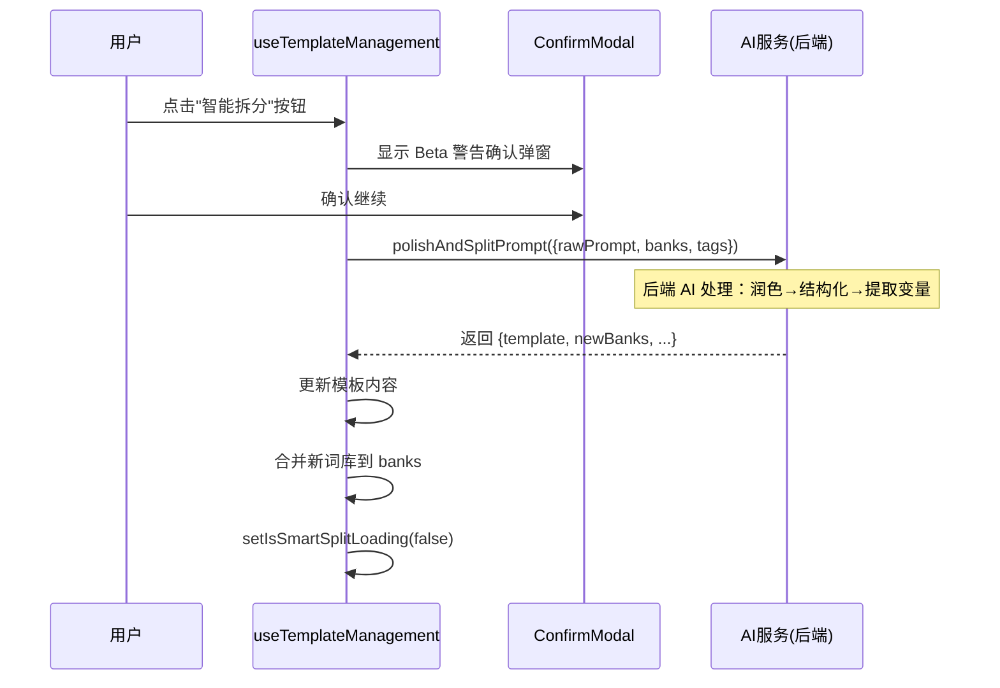

# PromptFill — 项目全景施工图纸 (Project Blueprint)

> 本文档是对 PromptFill 项目的全量分析文档，类比"房屋装修施工图纸"，覆盖地基、水电布线、智能控制器和软装细节。

---

## 目录 (Table of Contents)

1. [项目概览 (Project Overview)](#1-项目概览)
2. [技术栈 — 地基结构 (Tech Stack)](#2-技术栈--地基结构)
3. [目录树 — 4层深度 (Directory Tree)](#3-目录树--4层深度)
4. [路由与API — 水电布线 (Routes & API)](#4-路由与api--水电布线)
5. [Hooks与工具层 — 开关控制器 (Hooks & Utils)](#5-hooks与工具层--开关控制器)
6. [页面与组件分析 — 软装细节 (Pages & Components)](#6-页面与组件分析--软装细节)
7. [数据流与状态管理 (Data Flow)](#7-数据流与状态管理)
8. [核心业务逻辑 SOP 流程 (SOP Flows)](#8-核心业务逻辑-sop-流程)
9. [环境与版本依赖 (Environment & Dependencies)](#9-环境与版本依赖)
10. [已知问题与修复记录 (Known Issues)](#10-已知问题与修复记录)

---

## 1. 项目概览

**PromptFill（提示词填空器）** 是一款面向 AI 创作者的专业提示词管理与优化工具，帮助用户通过模板化和变量填充快速构建高质量 AI Prompt。

| 属性 | 值 |
|------|-----|
| 版本 | `0.9.2` (App) / `0.9.3` (Data) |
| 类型 | Web PWA + Tauri 桌面/移动端 |
| 语言 | 中文 (CN) / 英文 (EN) 双语 |
| 部署 | Vercel (主) / Docker / Tauri |
| 存储 | IndexedDB + LocalStorage (离线优先) |
| 开源协议 | MIT |

---

## 2. 技术栈 — 地基结构

> 类比：语言、框架、架构是房子的地基（钢筋混凝土结构）

### 核心框架

```
React 18.2        → UI 框架（函数式组件 + Hooks）
Vite 5.x          → 构建工具（HMR 开发，esbuild 生产）
React Router 7.x  → 客户端路由（SPA 单页应用）
Tailwind CSS 3.4  → 原子化 CSS 样式系统
```

### 关联库

```
framer-motion 12  → 动画系统（页面过渡、微交互）
lucide-react      → 图标库（100+ SVG 图标）
pako 2.1          → deflate 压缩（模板分享数据压缩）
html2canvas 1.4   → DOM → JPG 图片导出
qrcode.react      → QR 码生成（模板分享）
clsx + tw-merge   → 条件类名合并工具
```

### 平台层

```
Tauri 2.x         → 跨平台桌面/移动端打包（Rust 核心）
  ├── plugin-fs   → 文件系统访问（本地文件夹存储模式）
  ├── plugin-http → HTTP 请求（绕过 WKWebView CORS/ATS 限制）
  └── plugin-opener → 系统浏览器打开外链
```

---

## 3. 目录树 — 4层深度

```
PromptFill/
├── index.html                    # HTML 入口 + SEO + PWA 配置
├── vite.config.js                # 构建配置（Vite + Tauri 双目标）
├── tailwind.config.js            # Tailwind 主题配置
├── postcss.config.js             # PostCSS 插件链
├── package.json                  # 依赖声明 (v0.9.2)
├── vercel.json                   # Vercel 部署 + SPA 重写规则
├── Dockerfile                    # Docker 容器化 (nginx + node:20)
├── .eslintrc.cjs                 # ESLint 配置
├── .env.example                  # 环境变量示例
│
├── src/
│   ├── main.jsx                  # React 入口 + 路由定义
│   ├── App.jsx                   # 主应用组件 (~145KB)
│   ├── index.css                 # 全局样式
│   │
│   ├── pages/
│   │   ├── index.js              # 页面统一导出
│   │   └── PrivacyPage.jsx       # 隐私政策独立页面
│   │
│   ├── components/
│   │   ├── index.js              # 组件统一导出
│   │   ├── Variable.jsx          # 变量填空 UI 核心组件
│   │   ├── VisualEditor.jsx      # 可视化 Markdown 编辑器
│   │   ├── TemplateEditor.jsx    # 模板编辑面板
│   │   ├── TemplatePreview.jsx   # 模板预览面板
│   │   ├── TemplateCarousel.jsx  # 模板轮播展示
│   │   ├── EditorToolbar.jsx     # 编辑器工具栏
│   │   ├── Sidebar.jsx           # 主侧边栏框架
│   │   ├── TemplatesSidebar.jsx  # 模板列表侧栏
│   │   ├── BanksSidebar.jsx      # 词库配置侧栏
│   │   ├── TagSidebar.jsx        # 标签筛选侧栏
│   │   ├── SettingsView.jsx      # 设置视图（桌面端）
│   │   ├── MobileSettingsView.jsx # 设置视图（移动端）
│   │   ├── MobileTabBar.jsx      # 移动端底部Tab栏
│   │   ├── DiscoveryView.jsx     # 发现/广场视图
│   │   ├── PremiumButton.jsx     # 高级功能按钮
│   │   ├── FireworkEffect.jsx    # 烟花特效
│   │   ├── Lightbox.jsx          # 图片灯箱
│   │   ├── Tooltip.jsx           # 提示气泡
│   │   │
│   │   ├── icons/                # 自定义 SVG 图标组件
│   │   │   └── WaypointsIcon.jsx (+ 14 others)
│   │   │
│   │   ├── modals/               # 弹窗组件集
│   │   │   ├── ShareOptionsModal.jsx
│   │   │   ├── ShareImportModal.jsx
│   │   │   ├── ImportTokenModal.jsx
│   │   │   ├── CategoryManagerModal.jsx
│   │   │   ├── LinkTemplateModal.jsx
│   │   │   ├── AddTemplateTypeModal.jsx
│   │   │   ├── VideoSubTypeModal.jsx
│   │   │   ├── CopySuccessModal.jsx
│   │   │   ├── ConfirmModal.jsx
│   │   │   └── SponsorModal.jsx
│   │   │
│   │   ├── mobile/               # 移动端专属组件
│   │   │   ├── MobileBottomNav.jsx
│   │   │   └── MobileVideoFirstFrame.jsx
│   │   │
│   │   ├── preview/              # 预览相关组件
│   │   │   ├── ImagePreviewModal.jsx
│   │   │   ├── SourceAssetModal.jsx
│   │   │   └── AnimatedSlogan.jsx
│   │   │
│   │   └── notifications/        # 通知组件
│   │       ├── DataUpdateNotice.jsx
│   │       └── AppUpdateNotice.jsx
│   │
│   ├── hooks/
│   │   ├── index.js
│   │   ├── useStickyState.js       # LocalStorage 持久化状态
│   │   ├── useAsyncStickyState.js  # IndexedDB 异步持久化状态
│   │   ├── useEditorHistory.js     # 编辑器撤销/重做历史
│   │   ├── useLinkageGroups.js     # 变量联动组管理
│   │   ├── useShareFunctions.js    # 分享功能逻辑
│   │   ├── useTemplateManagement.js # 模板增删改查
│   │   └── useServiceWorker.js     # PWA Service Worker
│   │
│   ├── utils/
│   │   ├── index.js
│   │   ├── helpers.js    # 通用工具（压缩、剪贴板、深拷贝等）
│   │   ├── db.js         # IndexedDB 封装（openDB/dbGet/dbSet）
│   │   ├── aiService.js  # AI 服务调用（生成词条/智能拆分）
│   │   ├── platform.js   # 平台检测 + 跨平台 fetch/openLink
│   │   ├── merge.js      # 系统模板/词库合并策略
│   │   └── icloud.js     # iCloud 数据同步
│   │
│   ├── constants/
│   │   ├── translations.js  # i18n 翻译字典 (CN/EN)
│   │   ├── aiConfig.js      # AI 功能开关与参数配置
│   │   ├── styles.js        # Tailwind 类名映射（分类颜色等）
│   │   ├── masonryStyles.js # 瀑布流布局配置
│   │   ├── modalMessages.js # 弹窗文案常量
│   │   ├── slogan.js        # 海报标语常量
│   │   └── featureFlags.js  # 功能特性开关
│   │
│   └── data/
│       ├── templates.js  # 系统模板定义（INITIAL_TEMPLATES_CONFIG）
│       └── banks.js      # 词库/分类定义（INITIAL_BANKS）
│
├── public/
│   ├── data/             # 构建时生成（sync-data.js 输出）
│   │   ├── templates.json
│   │   ├── banks.json
│   │   └── version.json
│   └── [其他静态资源: manifest.json, icons, og-image等]
│
├── scripts/
│   └── sync-data.js      # 构建脚本：将 src/data/*.js → public/data/*.json
│
└── docs/
    └── ios-version-guide.md
```

---

## 4. 路由与API — 水电布线

> 类比：API 路由、钩子是房屋的水电布线

### 4.1 前端路由 (React Router)

```
BrowserRouter
├── /           → <App />   主界面（含内部视图切换）
├── /setting    → <App />   设置页面（由 App 内部处理路径）
├── /privacy    → <PrivacyPage />  独立隐私政策页
└── /*          → <App />   404 fallback
```

**内部视图状态**（非路由，通过 `useState` 控制）：
```
activeView 状态机：
  'preview'     → 预览交互模式
  'edit'        → 模板编辑模式
  'banks'       → 词库配置模式
  'settings'    → 设置模式
  'discovery'   → 发现/广场模式
```

### 4.2 外部 API 调用

#### AI 服务接口 (`src/utils/aiService.js`)

```
POST https://data.tanshilong.com/api/ai/process
Content-Type: application/json

Body (生成词条):
{
  action: 'generate-terms',
  language: 'cn' | 'en',
  payload: {
    variableLabel: string,     // 变量标签
    context: string,           // 模板上下文
    localOptions: string[],    // 本地词库（最多15条）
    currentValue: string,
    count: number,             // 生成数量
    selectedValues: {}         // 用户已选的其他变量值
  }
}

Body (智能拆分):
{
  action: 'polish-and-split',
  language: 'cn' | 'en',
  payload: {
    rawPrompt: string,
    existingBankContext: string,
    availableTags: string[]
  }
}

响应:
{ success: true, terms: string[] }   // 生成词条
{ success: true, data: {...} }       // 智能拆分结果
```

#### 云端数据更新检测

```
GET /data/version.json    → 获取最新数据版本号（静态文件）
GET /data/templates.json  → 获取最新模板数据
GET /data/banks.json      → 获取最新词库数据
```

#### 分享短链接 API（可选，需自部署）

```
环境变量: VITE_SHARE_API_URL=https://your-api.com/api/share
POST /api/share            → 创建短链接，返回 token
GET  /api/share/:token     → 读取分享数据
```

### 4.3 平台层请求封装 (`platform.js`)

```javascript
smartFetch(url, options)
  ├── Tauri 环境 → @tauri-apps/plugin-http（绕过 CORS/ATS）
  └── 浏览器环境 → native fetch()
```

---

## 5. Hooks与工具层 — 开关控制器

> 类比：中继器、中台、装饰器是家庭智能控制系统

### 5.1 自定义 Hooks

| Hook | 位置 | 功能 |
|------|------|------|
| `useStickyState` | `hooks/useStickyState.js` | LocalStorage 同步持久化，类似 `useState` 但自动持久化 |
| `useAsyncStickyState` | `hooks/useAsyncStickyState.js` | IndexedDB 异步持久化，用于大数据（模板/词库） |
| `useEditorHistory` | `hooks/useEditorHistory.js` | 编辑器撤销/重做历史栈管理 |
| `useLinkageGroups` | `hooks/useLinkageGroups.js` | 变量联动组（同名变量全局同步） |
| `useShareFunctions` | `hooks/useShareFunctions.js` | 模板分享/导入逻辑（压缩、QR码、短链接） |
| `useTemplateManagement` | `hooks/useTemplateManagement.js` | 模板 CRUD（增删改查、AI拆分集成） |
| `useServiceWorker` | `hooks/useServiceWorker.js` | PWA Service Worker 注册与更新检测 |

### 5.2 工具函数 (`utils/`)

| 函数 | 文件 | 用途 |
|------|------|------|
| `deepClone` | `helpers.js` | 对象深拷贝 |
| `makeUniqueKey` | `helpers.js` | 生成唯一 ID（避免重复） |
| `compressTemplate` | `helpers.js` | pako deflate 压缩模板数据（分享用） |
| `decompressTemplate` | `helpers.js` | 解压分享数据 |
| `copyToClipboard` | `helpers.js` | 跨平台剪贴板（支持 iOS Tauri fallback） |
| `getLocalized` | `helpers.js` | 取双语对象的当前语言值 |
| `getSystemLanguage` | `helpers.js` | 检测系统语言（cn/en） |
| `waitForImageLoad` | `helpers.js` | 等待图片加载完成（用于导出前） |
| `openDB / dbGet / dbSet` | `db.js` | IndexedDB CRUD 操作 |
| `generateAITerms` | `aiService.js` | AI 词条生成 |
| `polishAndSplitPrompt` | `aiService.js` | AI 智能润色与拆分 |
| `smartFetch` | `platform.js` | 跨平台 HTTP 请求 |
| `openExternalLink` | `platform.js` | 跨平台外链打开 |
| `mergeTemplatesWithSystem` | `merge.js` | 用户数据与系统更新数据合并 |
| `mergeBanksWithSystem` | `merge.js` | 词库数据合并 |
| `uploadToICloud` | `icloud.js` | iCloud 数据上传 |
| `downloadFromICloud` | `icloud.js` | iCloud 数据下载 |

### 5.3 常量与配置 (`constants/`)

| 文件 | 关键导出 | 用途 |
|------|---------|------|
| `translations.js` | `TRANSLATIONS` | 全量 i18n 字典（cn/en 两套） |
| `aiConfig.js` | `AI_FEATURE_ENABLED`, `AI_SMART_SPLIT_ENABLED` | AI 功能开关（部署快速关闭入口） |
| `styles.js` | `CATEGORY_STYLES`, `TAG_STYLES` | 分类颜色 Tailwind 类映射 |
| `modalMessages.js` | `SMART_SPLIT_CONFIRM_MESSAGE` | 弹窗文案 |
| `featureFlags.js` | `FEATURE_FLAGS` | 功能特性开关（可扩展） |

---

## 6. 页面与组件分析 — 软装细节

> 类比：UI、前端是家具软装细节

### 6.1 页面一览

#### 页面：主应用 `/` 和 `/setting` → `App.jsx`

这是一个**超大单文件组件**（~145KB），包含整个应用的核心状态和视图切换逻辑。内部通过 `activeView` 状态切换不同功能区：

| 视图 | 触发条件 | 包含组件 |
|------|---------|---------|
| `preview` (预览) | 默认 / 点击"预览交互" | `TemplatePreview`, `Variable`, `BanksSidebar`, `TemplatesSidebar` |
| `edit` (编辑) | 点击"编辑模版" | `TemplateEditor`, `VisualEditor`, `EditorToolbar` |
| `banks` (词库) | 点击"词库配置" | `BanksSidebar` (展开全屏) |
| `discovery` (发现) | 点击发现图标 | `DiscoveryView` (瀑布流模板广场) |
| `settings` (设置) | 点击设置图标 / 路由 `/setting` | `SettingsView` / `MobileSettingsView` |

**引用的弹窗组件**（条件渲染）：
- `ShareOptionsModal` — 分享选项
- `ShareImportModal` — 分享导入
- `ImportTokenModal` — Token 导入
- `CategoryManagerModal` — 分类管理
- `ConfirmModal` — 通用确认弹窗
- `AddTemplateTypeModal` — 新增模板类型选择
- `VideoSubTypeModal` — 视频模板子类型
- `DataUpdateNotice` — 数据更新通知
- `AppUpdateNotice` — 应用更新通知

#### 页面：隐私政策 `/privacy` → `PrivacyPage.jsx`

- **独立页面**，不依赖主 App 状态
- 自带语言切换（cn/en）
- 自带深色模式检测（`window.matchMedia`）
- 包含：返回按钮、隐私政策全文（双语）、语言切换器

### 6.2 核心组件详解

#### `Variable.jsx` — 变量填空核心

每个 `{{variableName}}` 渲染为此组件。功能：
- 下拉选择词库选项
- 自定义输入（新增选项同步回词库）
- AI 智能词条生成按钮（调用 `generateAITerms`）
- 联动组支持（`useLinkageGroups`）
- 分类颜色高亮

#### `TemplateEditor.jsx` — 模板编辑器

- 纯文本编辑 + `{{variable}}` 语法高亮
- 与 `VisualEditor.jsx` 协作（Markdown 预览）
- 撤销/重做（`useEditorHistory`）
- 变量插入工具栏

#### `TemplatePreview.jsx` — 预览面板

- 解析模板内容，渲染 `Variable` 组件
- 复制按钮（`copyToClipboard`）
- 导出长图（`html2canvas`）
- 多模板快速切换

#### `BanksSidebar.jsx` — 词库侧栏

- 展示所有变量组和选项
- 拖拽插入变量
- 分类颜色管理
- 搜索过滤

#### `DiscoveryView.jsx` — 发现广场

- 从 `/data/templates.json` 加载官方模板
- 瀑布流布局（`MASONRY_STYLES`）
- 一键导入模板
- 标签筛选

#### `SettingsView.jsx` — 设置面板

- 主题切换（浅色/深色/系统）
- 语言切换
- 存储模式切换（浏览器/本地文件夹）
- 数据导入导出
- iCloud 同步
- 存储空间管理

---

## 7. 数据流与状态管理

### 7.1 存储分层架构

```
┌─────────────────────────────────────────────────────┐
│  应用状态 (React State in App.jsx)                   │
│  ┌──────────────────┐  ┌──────────────────────────┐  │
│  │  useStickyState  │  │  useAsyncStickyState     │  │
│  │  (LocalStorage)  │  │  (IndexedDB)             │  │
│  │                  │  │                          │  │
│  │  - language      │  │  - templates (大)        │  │
│  │  - themeMode     │  │  - banks (大)            │  │
│  │  - activeId      │  │  - categories (大)       │  │
│  │  - dataVersion   │  │  - defaults              │  │
│  └──────────────────┘  └──────────────────────────┘  │
└─────────────────────────────────────────────────────┘
         ↕ 可选升级
┌─────────────────────────┐
│  本地文件夹模式          │
│  (File System Access API)│
│  prompt_fill_data.json   │
└─────────────────────────┘
         ↕ 可选升级
┌─────────────────────────┐
│  iCloud 同步            │
│  (Tauri iOS 专属)        │
└─────────────────────────┘
```

### 7.2 关键状态说明

| 状态变量 | 存储位置 | 类型 | 用途 |
|---------|---------|------|------|
| `templates` | IndexedDB `app_templates_v10` | `TemplateConfig[]` | 所有模板数据 |
| `banks` | IndexedDB `app_banks_v9` | `BankGroup[]` | 所有词库数据 |
| `categories` | IndexedDB `app_categories_v1` | `Category[]` | 分类定义 |
| `language` | LocalStorage `app_language_v1` | `'cn'|'en'` | UI 语言 |
| `templateLanguage` | LocalStorage `app_template_language_v1` | `'cn'|'en'` | 模板内容语言 |
| `themeMode` | LocalStorage `app_theme_mode_v1` | `'light'|'dark'|'system'` | 主题模式 |
| `activeTemplateId` | LocalStorage `app_active_template_id_v4` | `string` | 当前激活模板 ID |

---

## 8. 核心业务逻辑 SOP 流程

### 8.1 模板预览与填空流程



### 8.2 模板编辑流程



### 8.3 模板分享流程



### 8.4 数据更新检测流程



### 8.5 AI 智能拆分 (Smart Split) 流程



---

## 9. 环境与版本依赖

### 9.1 运行环境要求

| 环境 | 最低版本 | 推荐版本 |
|------|---------|---------|
| Node.js | 18+ | 20 LTS |
| npm | 8+ | 随 Node.js 20 |
| 浏览器 | Chrome 90+ / Safari 14+ | 最新版 |

### 9.2 关键版本锁定说明

```
react: ^18.2.0          — 使用 JSX Transform (无需 import React)
react-router-dom: ^7.x  — 注意：v7 API 与 v6 有差异
tailwindcss: ^3.4.0     — v3 (非 v4，v4 有 breaking changes)
vite: ^5.0.8            — v5 (非 v6)
framer-motion: ^12.x    — v12 API (motion.div 等)
@tauri-apps/cli: ^2.x   — Tauri v2 (非 v1)
```

### 9.3 环境变量

```bash
# .env.example 中定义的变量
VITE_SHARE_API_URL=https://your-api.com/api/share  # 可选：私有分享服务器
TAURI_PLATFORM=ios|android|windows|macos|linux     # Tauri 构建时自动注入
TAURI_DEBUG=true                                    # 开启源码映射
```

### 9.4 构建命令

```bash
npm run dev          # 开发服务器 (localhost:1420)
npm run build        # 生产构建 (sync-data → vite build → dist/)
npm run sync-data    # 同步数据文件 (src/data/*.js → public/data/*.json)
npm run lint         # ESLint 代码检查
npm run preview      # 预览生产构建
npm run tauri        # Tauri 桌面/移动端构建
```

---

## 10. 已知问题与修复记录

### 10.1 已修复问题 ✅

| 编号 | 文件 | 问题描述 | 修复方式 |
|------|------|---------|---------|
| #001 | `index.html` | **标题拼写错误**：`管理与管理工具` | 修正为 `管理与优化工具` |
| #002 | `src/data/templates.js` | **JSDoc 注释乱码**：示例代码中的 `bestModel`、`baseImage` 字段错误混入 JSDoc 注释块，且存在重复行 | 清理乱入的代码片段，保留正确的 `language: "cn" // 或 ["cn"]` |
| #003 | `.eslintrc.cjs`（缺失） | **缺少 ESLint 配置文件**：`npm run lint` 报 "ESLint couldn't find a configuration file" 完全无法运行 | 新建 `.eslintrc.cjs`，配置 React + Hooks + react-refresh 规则，并为 `vite.config.js`/`scripts/` 配置 Node.js 环境 |

### 10.2 已知待优化问题 ⚠️

| 编号 | 文件 | 问题描述 | 严重程度 |
|------|------|---------|---------|
| W001 | `App.jsx` | 文件体积过大（~145KB 单文件），包含过多逻辑，建议继续拆分 | 中 |
| W002 | `App.jsx` | 多处 `useEffect`/`useCallback`/`useMemo` 依赖数组不完整（react-hooks/exhaustive-deps 警告） | 低 |
| W003 | `App.jsx:372` | 变量 `charCode` 赋值但从未使用 (`no-unused-vars`) | 低 |
| W004 | `App.jsx:575` | 空的 `catch {}` 块 (`no-empty`) | 低 |
| W005 | `src/utils/helpers.js:23,26` | 空的 `try/catch` 块 | 低 |
| W006 | `src/utils/helpers.js:125` | 变量 `templateId` 赋值但从未使用 | 低 |
| W007 | `src/utils/merge.js:62` | 参数 `backupSuffix` 已定义但未使用（解构时）| 低 |
| W008 | `src/pages/PrivacyPage.jsx:1` | `React` 导入但未使用（JSX Transform 已处理） | 低 |
| W009 | 全局 | 缺少自动化测试（无 unit/integration 测试） | 中 |
| W010 | `src/utils/aiService.js` | 云端 API URL 硬编码，建议改为环境变量 | 低 |

---

*文档生成时间：2026-03-02 | 项目版本：v0.9.2*
