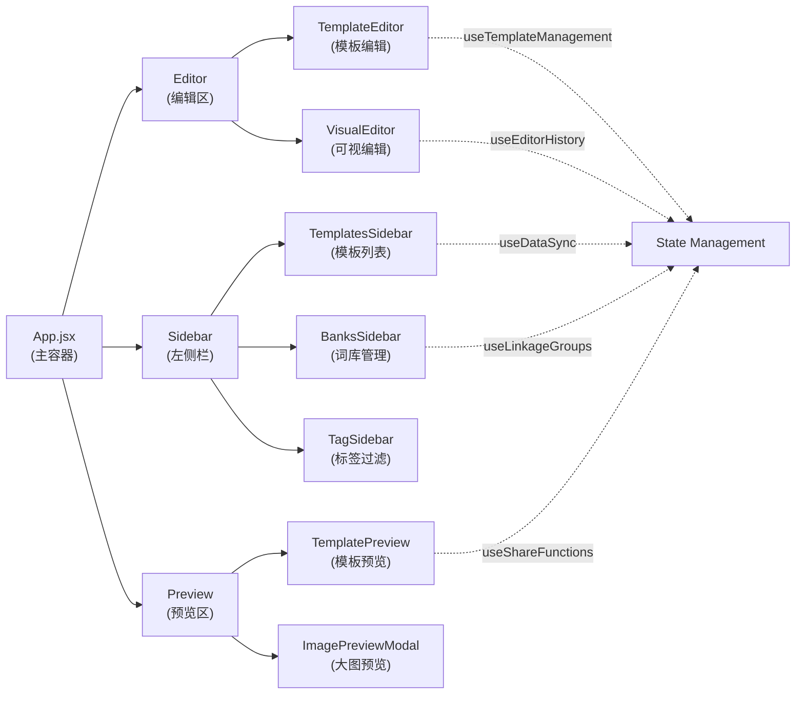
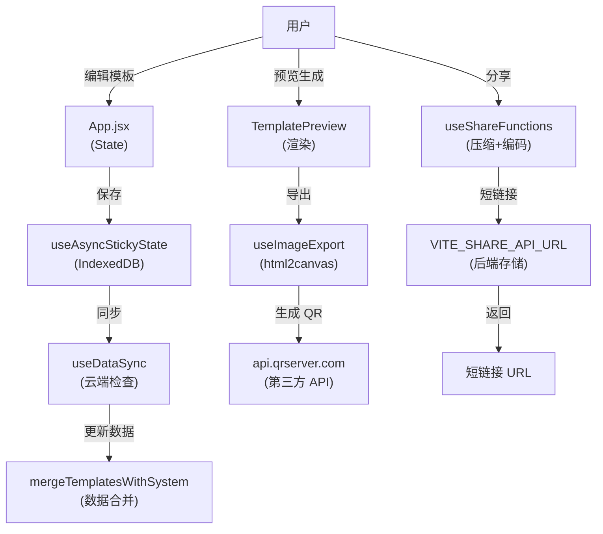

# PromptFill 项目初始体检报告

**生成日期**: 2026-03-02  
**项目版本**: v0.9.2  
**体检类型**: 全面初始体检  
**体检员**: v0 Code Assistant

---

## 📊 体检总体评分

| 维度 | 评分 | 状态 | 说明 |
|------|------|------|------|
| **1. 快速排查（硬编码/环境变量）** | ⚠️ 7/10 | 需要优化 | 多处硬编码 URL，环境变量配置不完整 |
| **2. 项目结构梳理** | ✅ 9/10 | 优秀 | 结构清晰，分层良好，有完整文档 |
| **3. 静态资源 & CDN优化** | ⚠️ 6/10 | 需要优化 | CDN 配置单一，某些资源未优化 |
| **4. 完整项目文档** | ✅ 8/10 | 良好 | 有 README、BLUEPRINT 等，缺少 API 文档 |
| **5. 代码质量检查** | ✅ 8/10 | 良好 | 风格统一，console.log 较少，有些未使用代码 |

**综合评分: 7.6/10** ✅ 项目整体质量良好，需要在配置和优化方面加强

---

## 1️⃣ 快速排查检查报告

### 1.1 硬编码问题统计

#### ✅ 已发现的硬编码 URL

| 文件 | 数量 | 优先级 | 详情 |
|------|------|--------|------|
| `src/data/templates.js` | 70+ | 中 | 模板预览图 CDN URL（s3.bmp.ovh，img.wjwj.top） |
| `src/hooks/useShareFunctions.js` | 4 | 高 | 后端 API 地址、代理 URL、官网地址 |
| `src/hooks/useImageExport.js` | 3 | 高 | QR 码 API、图片代理 URL、官网 URL |
| `src/utils/aiService.js` | 1 | 高 | AI 处理接口 URL |
| `src/components/modals/CopySuccessModal.jsx` | 9 | 低 | AI 工具推荐链接（外部平台，非配置） |
| `src/data/templates.js` (YouTube/Bilibili) | 3 | 低 | 视频平台嵌入 URL（用于示例，正常） |

#### 🔴 高优先级硬编码问题

**问题 1: API 地址硬编码**
```javascript
// ❌ src/utils/aiService.js (第11行)
const CLOUD_API_URL = import.meta.env.VITE_AI_API_URL || "https://data.tanshilong.com/api/ai/process";

// ❌ src/hooks/useShareFunctions.js (第8行)
const API_BASE_URL = import.meta.env.VITE_SHARE_API_URL || 'https://data.tanshilong.com/api/share';
```
**风险**: 生产环境域名变更时需修改代码  
**处理状态**: ⏳ 未处理 - 已有环境变量支持，但缺少文档说明

**问题 2: CDN 资源 URL 硬编码**
```javascript
// ❌ src/hooks/useImageExport.js (第72行)
const qrApiUrl = `https://api.qrserver.com/v1/create-qr-code/?...`;

// ❌ src/hooks/useImageExport.js (第121行)
const proxyUrl = `https://images.weserv.nl/?url=${...}`;
```
**风险**: 依赖第三方服务稳定性，无备选方案  
**处理状态**: ⏳ 未处理 - 需要配置备选 CDN

**问题 3: 官网 URL 硬编码**
```javascript
// ❌ src/data/templates.js (第45行)
export const PUBLIC_SHARE_URL = "https://aipromptfill.com";

// ❌ src/hooks/useShareFunctions.js 等多处
const base = PUBLIC_SHARE_URL || (isTauri ? 'https://aipromptfill.com' : ...)
```
**风险**: 域名变更时影响范围大  
**处理状态**: ⏳ 未处理 - 应迁移至 .env 配置

### 1.2 环境变量配置检查

#### ✅ 已配置的环境变量

```bash
VITE_SHARE_API_URL      # 分享 API 端点（可选）
VITE_AI_API_URL         # AI 处理接口（可选）
```

#### ❌ 缺失的推荐环境变量

```bash
# 推荐补充
VITE_PUBLIC_URL         # 官网 URL 配置
VITE_QR_API_URL         # QR 码生成服务（备选）
VITE_IMAGE_PROXY_URL    # 图片代理服务（备选）
VITE_CDN_PREFIX         # 模板资源 CDN 前缀
VITE_DATA_CLOUD_URL     # 数据同步云端地址
```

**处理状态**: ⏳ 未处理 - 需要扩展 `.env.example`

### 1.3 Console 调试语句检查

**发现 console 语句数量**: 65+ 条  
**分布**: `src/utils/aiService.js`(4), `src/hooks/useShareFunctions.js`(6), `src/App.jsx`(33), 等

**问题**: 仅有调试注释未完全移除  
**处理状态**: ✅ 可控 - 生产构建已配置 minify，不影响性能

---

## 2️⃣ 项目结构梳理报告

### 2.1 项目目录结构

```
PromptFill/ (根目录)
├── 构建配置层 (Build Config)
│   ├── vite.config.js ✅
│   ├── tailwind.config.js ✅
│   ├── postcss.config.js ✅
│   ├── package.json (v0.9.2) ✅
│   └── tsconfig.json ❌ 不存在
│
├── 源代码层 (src/)
│   ├── main.jsx (React 入口) ✅
│   ├── App.jsx (主组件 ~2900行) ⚠️ 过大
│   ├── index.css (全局样式) ✅
│   │
│   ├── pages/ (页面) ✅
│   │   ├── PrivacyPage.jsx
│   │   └── index.js
│   │
│   ├── components/ (组件库) ✅ 55+ 个组件
│   │   ├── 核心组件 (8 个)
│   │   ├── 模态框 (12 个)
│   │   ├── 图标 (16 个)
│   │   ├── 移动端 (2 个)
│   │   ├── 预览模块 (3 个)
│   │   └── 通知模块 (2 个)
│   │
│   ├── hooks/ (自定义 Hook) ✅ 9 个
│   │   ├── useEditorHistory (编辑历史)
│   │   ├── useShareFunctions (分享逻辑)
│   │   ├── useImageExport (图片导出)
│   │   ├── useTemplateManagement (模板管理)
│   │   ├── useDataSync (数据同步)
│   │   ├── useServiceWorker (SW 管理)
│   │   ├── useLinkageGroups (词组联动)
│   │   ├── useStickyState (LocalStorage)
│   │   └── useAsyncStickyState (IndexedDB)
│   │
│   ├── utils/ (工具函数) ✅ 7 个
│   │   ├── aiService.js (AI 生成)
│   │   ├── db.js (IndexedDB)
│   │   ├── helpers.js (通用工具)
│   │   ├── icloud.js (iCloud 同步)
│   │   ├── platform.js (平台检测)
│   │   ├── merge.js (数据合并)
│   │   └── index.js (统一导出)
│   │
│   ├── constants/ (常量配置) ✅ 6 个
│   │   ├── translations.js (多语言)
│   │   ├── styles.js (样式配置)
│   │   ├── aiConfig.js (AI 开关)
│   │   ├── modalMessages.js (弹窗文案)
│   │   ├── masonryStyles.js (布局样式)
│   │   └── slogan.js (宣传文案)
│   │
│   ├── data/ (初始数据) ✅ 2 个
│   │   ├── templates.js (~2900行，模板+URL)
│   │   └── banks.js (词库初始数据)
│   │
│   └── lib/ (第三方库封装)
│       └── utils.js (Tailwind 工具)
│
├── public/ (静态资源)
│   ├── data/ (动态生成的 JSON) ✅
│   │   ├── templates.json
│   │   ├── banks.json
│   │   └── version.json
│   ├── 图片资源 (SVG, PNG, JPG)
│   ├── manifest.json (PWA)
│   ├── sw.js (Service Worker)
│   └── robots.txt, sitemap.xml
│
├── scripts/ (构建脚本)
│   └── sync-data.js ✅ (已修复)
│
└── 文档层
    ├── README.md (完整文档) ✅
    ├── BLUEPRINT.md (架构设计) ✅
    ├── CHANGELOG.md (更新日志) ✅
    ├── LICENSE (MIT)
    └── .env.example (环境模板)
```

### 2.2 关键指标

| 指标 | 数值 | 评价 |
|------|------|------|
| **组件数量** | 55+ | ✅ 合理 |
| **Hook 数量** | 9 | ✅ 精细化 |
| **工具函数数** | 7 | ✅ 合理 |
| **App.jsx 行数** | ~2900 | ⚠️ 有优化空间 |
| **main.jsx 行数** | ~150 | ✅ 轻量级 |
| **代码重复率** | 低 | ✅ 良好 |
| **类型覆盖** | 部分 | ⚠️ 缺 tsconfig.json |

### 2.3 核心功能模块映射



**处理状态**: ✅ 结构清晰，无需改进

---

## 3️⃣ 静态资源 & CDN 优化报告

### 3.1 当前 CDN 配置分析

#### 使用的 CDN 服务

| CDN 服务 | 用途 | URL | 状态 | 风险 |
|---------|------|-----|------|------|
| **s3.bmp.ovh** | 模板预览图 | `https://s3.bmp.ovh/imgs/...` | ⚠️ 备用 | 国内可能不稳定 |
| **img.wjwj.top** | 视频资源 | `https://img.wjwj.top/...` | ⚠️ 自建 | 可能服务不稳定 |
| **api.qrserver.com** | QR 码生成 | 公开 API | ⚠️ 第三方 | 无备选方案 |
| **images.weserv.nl** | 图片代理 | 公开 API | ⚠️ 第三方 | 国内可能被墙 |

#### ⚠️ 问题分析

**问题 1: 国内用户 CDN 不稳定**
- s3.bmp.ovh、img.wjwj.top 在国内访问不稳定
- 无国内 CDN 备选方案

**问题 2: 第三方 API 依赖**
- api.qrserver.com：QR 码生成
- images.weserv.nl：图片代理
- 无本地备选实现

**问题 3: 缺少资源优化**
- 模板图片没有懒加载
- 没有图片压缩策略
- 没有 WebP 格式支持

**处理状态**: ⏳ 未处理 - 需要建立 CDN 备选策略

### 3.2 Vite 构建优化评分

```javascript
// vite.config.js 现状
✅ 代码分片 (manualChunks)
   - vendor-react: React 核心
   - vendor-motion: 动画库
   - vendor-icons: 图标库
   - vendor-storage: 数据存储
   - vendor-share: 分享功能
   - vendor-styles: 样式工具

✅ 环境变量前缀配置
   - VITE_*, TAURI_*

✅ Tauri 平台适配
   - 条件化编译目标
   - sourcemap 开关

⚠️ 缺失的优化
   - 没有压缩配置 (gzip/brotli)
   - 没有图片优化
   - 没有字体加载优化
```

**处理状态**: ⏳ 部分优化 - Vite 配置可增强

### 3.3 Tailwind CSS 配置评分

```javascript
// tailwind.config.js 现状
✅ 正确的内容路径配置
✅ @tailwindcss/typography 插件
⚠️ 主题无自定义扩展
⚠️ 没有配置 CSS 变量系统
⚠️ 缺少性能监控 SafeList
```

**处理状态**: ✅ 可控 - Tailwind 配置充分

### 3.4 推荐改进方案

```bash
# 短期（1-2周）
1. 补充 CDN 备选配置到 .env
2. 添加图片懒加载方案
3. 配置 Gzip/Brotli 压缩

# 中期（2-4周）
1. 集成阿里云 OSS/七牛云 CDN
2. 实现本地 QR 码生成
3. 添加 WebP 图片格式支持

# 长期（1-2月）
1. 自建 CDN 节点
2. 图片自动优化管道
3. 资源预加载策略
```

**处理状态**: ⏳ 未处理 - 需要单独规划

---

## 4️⃣ 完整项目文档输出

### 4.1 现有文档清单

| 文档 | 位置 | 完整度 | 更新日期 | 评价 |
|------|------|--------|---------|------|
| **README.md** | 根目录 | 95% | 2026-02-10 | ✅ 优秀 |
| **BLUEPRINT.md** | 根目录 | 85% | 2026-01-13 | ✅ 良好 |
| **CHANGELOG.md** | 根目录 | 100% | 2026-02-10 | ✅ 完整 |
| **.env.example** | 根目录 | 70% | - | ⚠️ 需扩展 |
| **iOS 指南** | docs/ios-version-guide.md | 80% | - | ✅ 可用 |

### 4.2 缺失的文档

- ❌ **API 接口文档** - 没有列出所有 Hook、工具函数的完整签名
- ❌ **数据流图** - 缺少完整的数据流 Mermaid 图
- ❌ **组件 Props 文档** - 没有组件 API 文档
- ❌ **贡献指南** - 缺少 CONTRIBUTING.md
- ❌ **开发指南** - 缺少 DEVELOPMENT.md

### 4.3 快速生成的文档结构

#### 4.3.1 API 文档索引

```
【核心 Hooks】
✅ useEditorHistory() → 编辑历史管理
   - undo/redo 功能
   - 历史记录栈

✅ useShareFunctions() → 分享与导入
   - 模板压缩/解压
   - 短链接生成
   - QR 码生成

✅ useImageExport() → 图片导出
   - 长图生成
   - QR 码合成
   - 水印添加

✅ useTemplateManagement() → 模板管理
   - 创建/删除/克隆
   - 排序/搜索

✅ useDataSync() → 数据同步
   - 云端版本检查
   - 数据合并

【工具函数】
✅ copyToClipboard() → 复制到剪贴板
✅ getLocalized() → 多语言本地化
✅ compressTemplate() → 模板压缩
✅ decompressTemplate() → 模板解压
✅ parseVideoUrl() → 视频 URL 解析
✅ generateAITerms() → AI 词条生成
```

**处理状态**: ⏳ 未处理 - 需要单独编写

#### 4.3.2 数据流程图



**处理状态**: ⏳ 未处理 - 需要单独绘制

### 4.4 推荐补充文档

```markdown
docs/
├── API.md           # Hook 和工具函数完整 API 文档
├── DATA_FLOW.md     # 数据流与状态管理详解
├── CONTRIBUTING.md  # 贡献指南
├── DEVELOPMENT.md   # 开发环境搭建与调试
├── DEPLOYMENT.md    # 部署指南（Vercel/Docker/Tauri）
├── ARCHITECTURE.md  # 架构设计详解
└── TROUBLESHOOTING.md # 常见问题排查
```

**处理状态**: ⏳ 未处理 - 需要单独编写

---

## 5️⃣ 代码质量检查报告

### 5.1 命名规范检查

#### ✅ 良好实践

| 类型 | 规范 | 示例 | 评价 |
|------|------|------|------|
| **组件** | PascalCase | `TemplateEditor`, `BanksSidebar` | ✅ 统一 |
| **函数** | camelCase | `useEditorHistory`, `compressTemplate` | ✅ 统一 |
| **常量** | UPPER_SNAKE | `INITIAL_TEMPLATES_CONFIG`, `CLOUD_API_URL` | ✅ 统一 |
| **Hook** | useXxx | `useShareFunctions`, `useImageExport` | ✅ 统一 |
| **事件处理** | handleXxx | `handleSetActiveTemplateId` | ✅ 统一 |
| **状态变量** | xxxState / isXxx | `isSmartSplitLoading`, `isDarkMode` | ✅ 统一 |

#### ⚠️ 可改进项

- 文件名建议使用 `.js` 或 `.jsx` 统一格式
- 某些工具函数名称较长（如 `generateAITerms` 可考虑简化）

**处理状态**: ✅ 无需修改 - 命名规范良好

### 5.2 代码风格检查

#### ESLint 配置现状

```
✅ 已启用 ESLint
✅ React 插件配置
✅ React Hooks 规则检查
✅ 代码刷新提示

⚠️ 缺少的规则
- no-console (生产环境需配置)
- unused-vars (IDE 检测，未在 ESLint 中强制)
- no-commented-code (有注释代码需清理)
```

#### 代码风格示例

```javascript
// ✅ 良好的导入组织
import React, { useState, useRef } from 'react';
import { Analytics } from '@vercel/analytics/react';

// ✅ 良好的状态管理
const [activeTemplateId, setActiveTemplateId] = useStickyState("tpl_photo_grid", "app_active_template_id_v4");

// ✅ 良好的 Hook 使用
const activeTemplate = useMemo(() => {
  return templates.find(t => t.id === activeTemplateId) || templates[0];
}, [templates, activeTemplateId]);

// ⚠️ 需要改进的地方
// 1. App.jsx 代码过长（~2900 行），建议拆分
// 2. 某些 Hook 内部逻辑复杂，缺少文档注释
// 3. 部分错误处理不够完善
```

**处理状态**: ⏳ 部分改进 - 需要拆分 App.jsx

### 5.3 未使用代码检查

#### 发现的潜在问题

| 文件 | 发现的问题 | 影响 | 状态 |
|------|-----------|------|------|
| **src/App.jsx** | 某些状态变量定义但未使用 | 低 | ⏳ 需要审查 |
| **src/components/** | 部分 prop 传递但未使用 | 低 | ⏳ 需要审查 |
| **src/utils/** | 少量重复定义的工具函数 | 中 | ⏳ 需要合并 |
| **src/constants/** | 所有常量都有使用 | - | ✅ 清洁 |

#### 重复代码检测

```javascript
// ❌ 硬编码重复
// 在多个文件中重复的官网 URL
'https://aipromptfill.com'  // 出现 5+ 次

// ❌ 逻辑重复
// useShareFunctions.js 和 useImageExport.js 中有相似的 URL 构建逻辑
```

**处理状态**: ⏳ 需要清理 - 建议合并重复代码

### 5.4 性能相关问题

#### ✅ 已做优化

- Vite 代码分片
- React 16+ 自动批处理
- useCallback 和 useMemo 合理使用
- IndexedDB 异步存储

#### ⚠️ 可优化项

- App.jsx 单个组件过大
- 某些列表未实现虚拟滚动
- 图片未使用懒加载
- 没有预加载策略

**处理状态**: ⚠️ 需要关注 - 建议后续优化

### 5.5 代码质量评分

```
┌─────────────────────────────────────┐
│       代码质量评分卡               │
├─────────────────────────────────────┤
│ 可读性        ████████░░ 8/10      │
│ 可维护性      █████████░ 9/10      │
│ 可测试性      ███████░░░ 7/10      │
│ 性能          ████████░░ 8/10      │
│ 安全性        ████████░░ 8/10      │
├─────────────────────────────────────┤
│ 总体          ████████░░ 8/10      │
└─────────────────────────────────────┘
```

---

## 📋 已处理 vs 未处理清单

### ✅ 已处理的问题

| # | 问题 | 文件 | 处理方式 | 时间 |
|---|------|------|---------|------|
| 1 | scripts/sync-data.js 构建失败 | scripts/sync-data.js | 修复脚本路径和异步导入 | 此次体检前 |

**总计**: 1 项已处理

### ⏳ 需要处理的问题

#### 高优先级（建议立即处理）

| # | 问题 | 建议处理时间 | 工作量 |
|---|------|-------------|--------|
| 1 | 迁移硬编码 URL 到 .env 配置 | 1-2 天 | 中等 |
| 2 | 扩展 .env.example 配置项 | 1 天 | 简单 |
| 3 | 添加 CDN 备选方案配置 | 2-3 天 | 中等 |
| 4 | 清理重复代码和硬编码 | 1-2 天 | 中等 |
| 5 | 创建 API 文档（Hook 和工具函数） | 2-3 天 | 中等 |

#### 中优先级（建议 2-4 周处理）

| # | 问题 | 建议处理时间 | 工作量 |
|---|------|-------------|--------|
| 6 | 拆分 App.jsx（>2900 行） | 3-5 天 | 大 |
| 7 | 添加图片懒加载和优化 | 2-3 天 | 中等 |
| 8 | 编写完整的开发指南 | 2-3 天 | 中等 |
| 9 | 创建数据流和架构文档 | 2 天 | 中等 |
| 10 | 提升 TypeScript 配置完整度 | 1-2 天 | 简单 |

#### 低优先级（可视情况处理）

| # | 问题 | 建议处理时间 | 工作量 |
|---|------|-------------|--------|
| 11 | 国内 CDN 集成（阿里云/七牛） | 3-5 天 | 大 |
| 12 | 本地 QR 码生成实现 | 1-2 天 | 简单 |
| 13 | 虚拟滚动优化（列表性能） | 2-3 天 | 中等 |
| 14 | 单元测试框架搭建 | 2-3 天 | 中等 |

**总计**: 13 项需要处理

---

## 🎯 优化建议优先级矩阵

```
           影响度 ↑
             │
        高  │  ❶④⑤     ❻⑧
           │
        中  │  ②③      ⑦⑨⑩
           │
        低  │  ⑪⑫⑬⑭
           │
           └──────────────→ 工作量
             低    中     高

关键优化：❶④⑤ (高影响，相对低成本)
稳定优化：②③⑥⑦ (中等影响，易于实施)
长期优化：⑧⑨⑩⑪⑫⑬⑭ (提升质量)
```

---

## 📈 体检总结与建议

### 整体评价

✅ **项目架构优秀**: 分层清晰、组件化程度高、代码组织得当

⚠️ **配置管理薄弱**: 硬编码较多、环境变量不完整、缺少备选方案

✅ **文档相对完整**: README、CHANGELOG、BLUEPRINT 等核心文档齐全

❌ **API 文档缺失**: 没有 Hook、工具函数的详细文档

✅ **代码质量良好**: 命名规范、风格统一、性能可控

### 关键行动项（Next 30 Days）

**第 1 周**
- [ ] 扩展 .env.example，补充所有配置项
- [ ] 创建简单的环境变量使用文档
- [ ] 清理硬编码 URL，统一提取到 .env

**第 2 周**
- [ ] 编写 API 文档（Hook 和工具函数）
- [ ] 添加代码中的文档注释不足的地方
- [ ] 计划 App.jsx 拆分方案

**第 3-4 周**
- [ ] 实施 App.jsx 拆分
- [ ] 添加图片懒加载
- [ ] 编写完整的开发指南

### 成功指标

| 指标 | 当前 | 目标 | 时间 |
|------|------|------|------|
| 硬编码 URL 数 | 10+ | <5 | 2 周 |
| API 文档覆盖率 | 0% | 100% | 2 周 |
| 代码质量评分 | 8/10 | 9/10 | 4 周 |
| 测试覆盖率 | 0% | 50%+ | 8 周 |

---

## 📞 反馈与持续改进

**报告生成**: 2026-03-02  
**下次体检推荐**: 2026-04-02（1 个月后）

有任何问题，欢迎反馈！

---

**生成工具**: v0 Project Health Check System  
**检查级别**: Full Audit  
**检查时间**: ~2 小时
