# PromptFill 数据流和架构文档

本文档使用 Mermaid 图表展示应用的数据流、架构层级和关键流程。

---

## 目录

1. [应用整体架构](#应用整体架构)
2. [数据流向图](#数据流向图)
3. [用户操作流程](#用户操作流程)
4. [模板分享流程](#模板分享流程)
5. [图片导出流程](#图片导出流程)
6. [组件层级关系](#组件层级关系)
7. [数据存储方案](#数据存储方案)
8. [API 集成架构](#api-集成架构)

---

## 应用整体架构

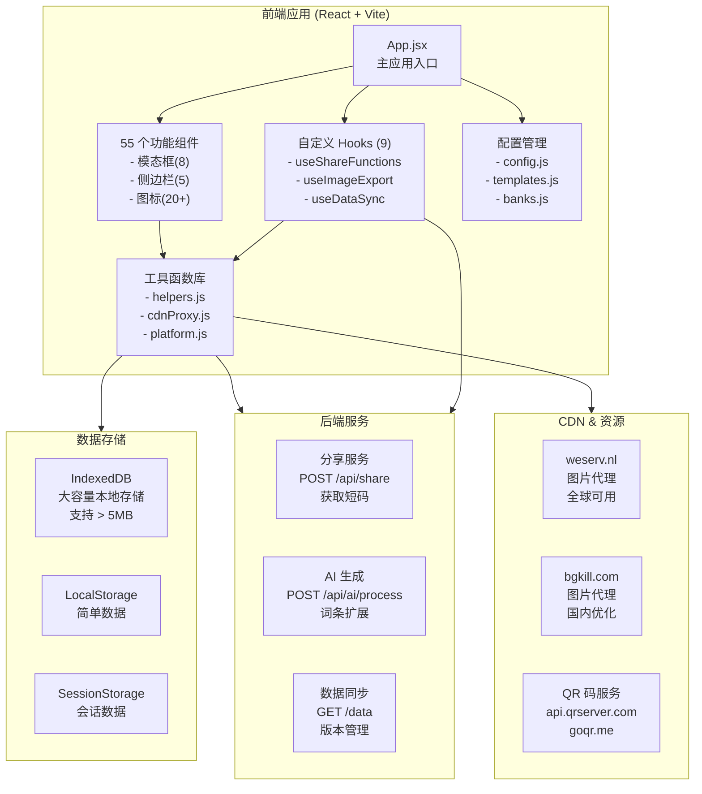

---

## 数据流向图

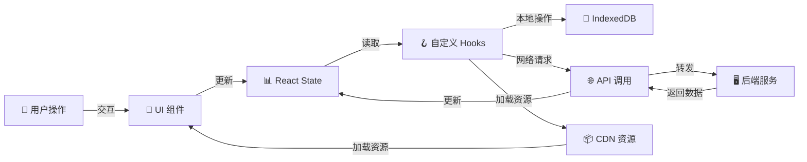

---

## 用户操作流程

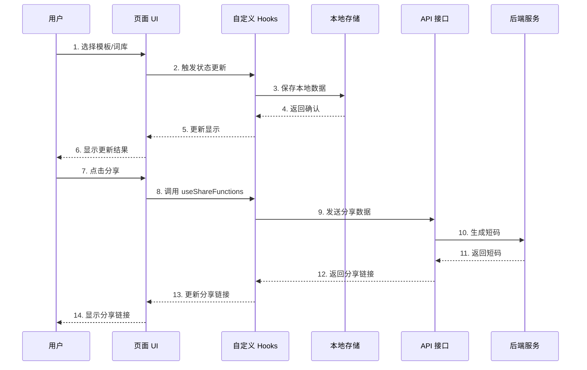

---

## 模板分享流程

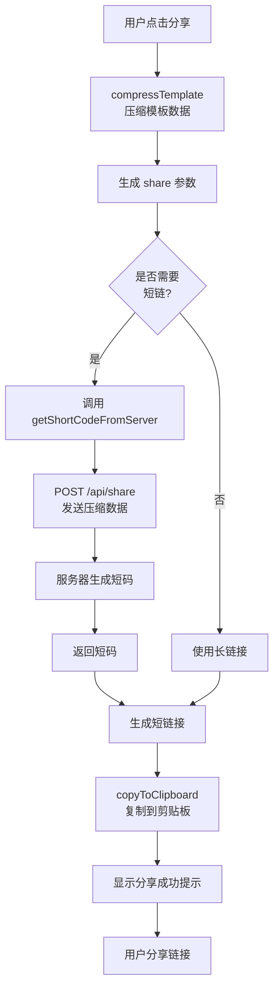

---

## 图片导出流程

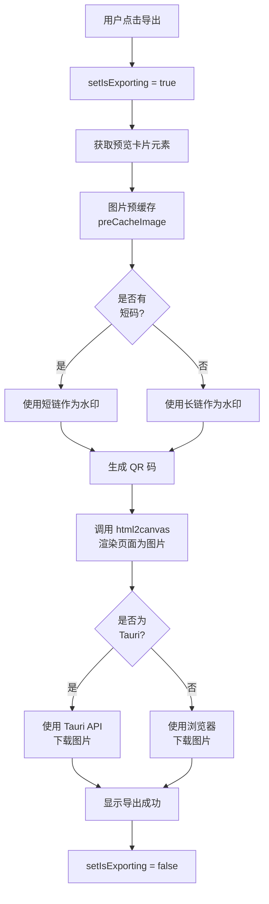

---

## 组件层级关系

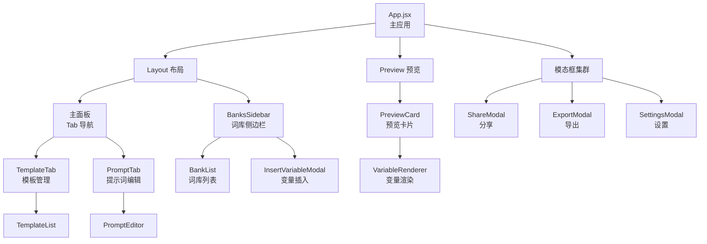

---

## 数据存储方案

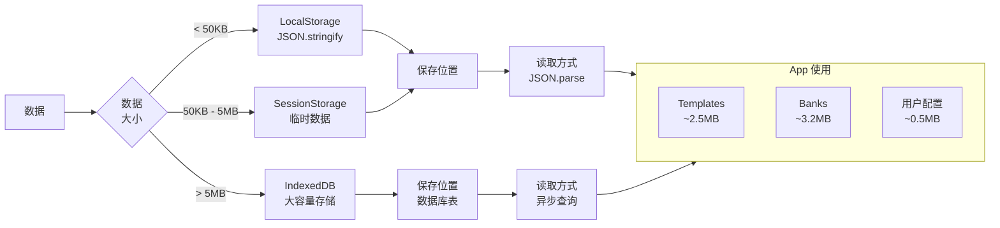

---

## API 集成架构

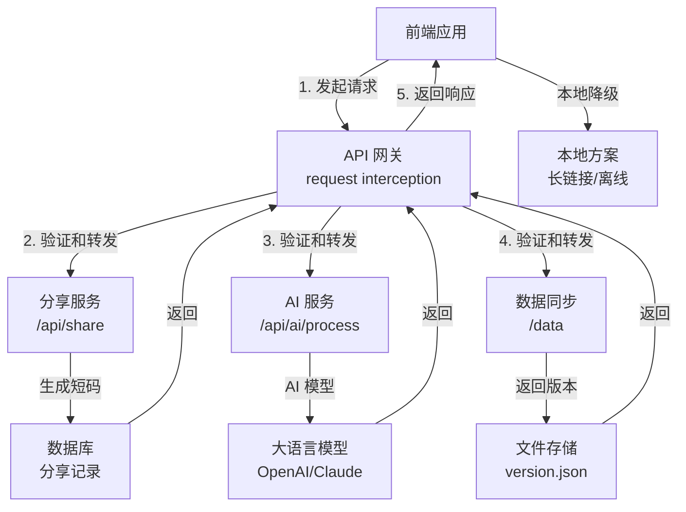

---

## CDN 智能备选方案

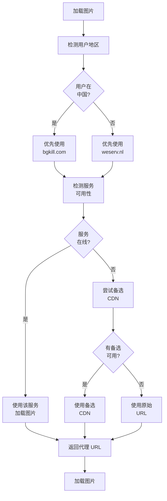

---

## 应用生命周期

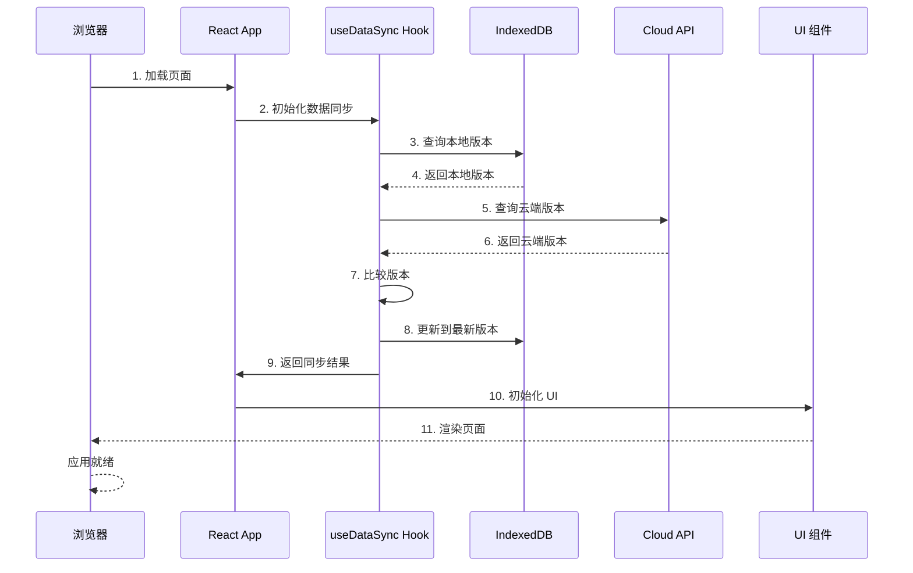

---

## 配置和环境变量流向

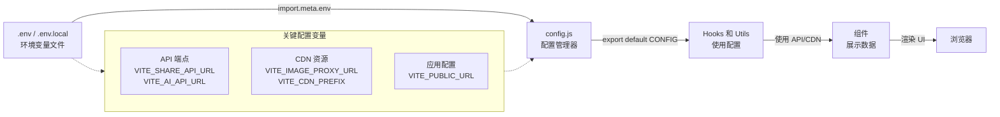

---

## 错误处理和降级方案

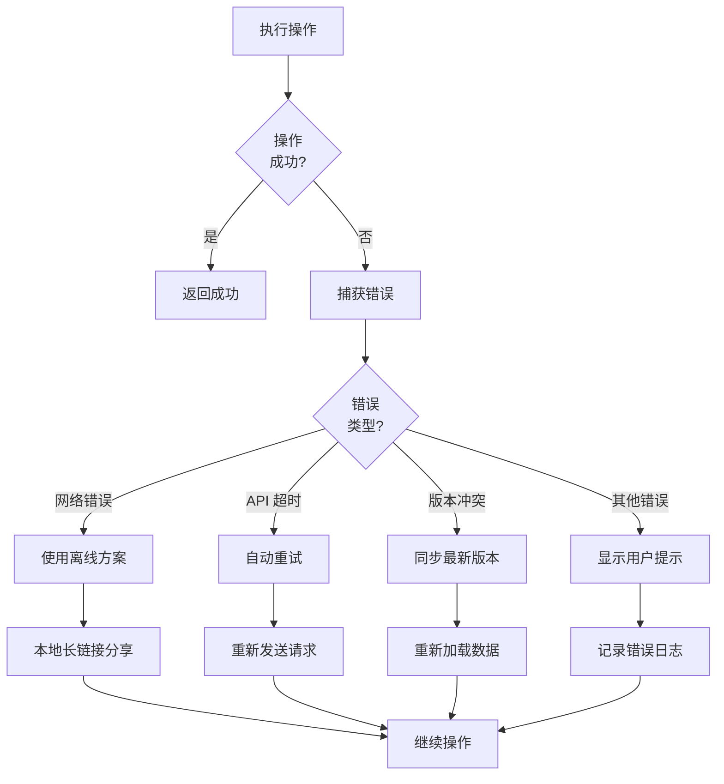

---

## 性能优化层级

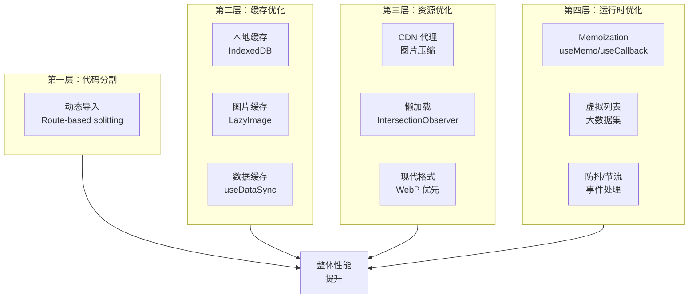

---

## 更新日志

- **v1.0.0** (2024-03-xx)
  - 完成应用整体架构设计
  - 绘制数据流向图
  - 记录所有主要流程
  - 文档化 CDN 智能方案

---

**最后更新**: 2024-03-xx
**维护者**: PromptFill Team

---

## 如何阅读本文档

1. **快速了解**: 先看"应用整体架构"和"数据流向图"
2. **深入某功能**: 查看对应的"流程图"（分享、导出等）
3. **调试时参考**: 查看"错误处理"和"组件层级"
4. **优化时参考**: 查看"性能优化"部分
5. **集成时参考**: 查看"API 集成架构"和"配置流向"

## 相关文档

- [API_HOOKS.md](./API_HOOKS.md) - 自定义 Hook API 详细文档
- [ENVIRONMENT_SETUP.md](./ENVIRONMENT_SETUP.md) - 环境变量配置指南
- [../BLUEPRINT.md](../BLUEPRINT.md) - 项目蓝图和技术栈
